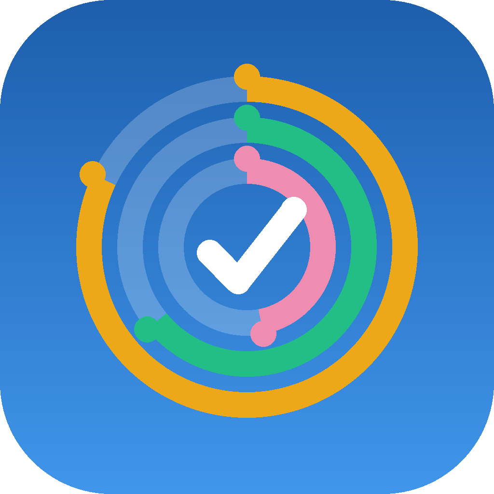

<p align="center">
  
</p>

<h1 align="center">Fidelis</h1>

<p align="center">App para cumplir tus objetivos diarios, semanales y mensuales, y no romper la racha.</p>

<p align="center">
  <a href="../../releases/latest"><b>⬇️ Descargar el APK (Android)</b></a>
  &nbsp;·&nbsp;
  <a href="https://willydkx.github.io/fidelis/"><b>🌐 Abrir la versión web</b></a>
</p>

---

## Qué hace

- **Bienvenida personalizada**: te pregunta tu nombre y qué quieres mejorar (ejercicio y salud, mente y aprendizaje, vida digital y finanzas, hogar y social) y te sugiere unos pocos objetivos para empezar, con metas suaves o ambiciosas.
- **Te saluda por tu nombre** según la hora del día («Buenos días, Ana») y lo usa en los recordatorios.
- **Registro diario**: marca los objetivos de sí/no con un toque o apunta cantidades en los numéricos (minutos, páginas, km…). Puedes registrar también días anteriores.
- **Cadencias flexibles**: objetivos diarios, semanales, mensuales o solo ciertos días de la semana. En los semanales y mensuales puedes pedir «N veces».
- **Estadísticas**: puntuación de eficiencia de los últimos 30 días, cumplimiento diario, mapa de constancia anual estilo GitHub, rachas actuales y récord, y cumplimiento por objetivo.
- **Recordatorios configurables**: hasta 5 horas al día, los días de la semana que elijas, avisar siempre o solo si te faltan objetivos, y mensaje personalizado (con `{nombre}` para incluir tu nombre).
- **Temporizador pomodoro (pestaña Enfoque)**: duraciones de enfoque y descansos personalizables, ciclo con descanso largo, inicio automático opcional y alarma al terminar cada fase (suena con el volumen de alarma o solo vibra). Puedes vincularlo a un objetivo en minutos para que cada sesión sume su tiempo al registro del día.
- **Organización**: pausa, archiva, reordena o elimina objetivos, y elige su color.

## Instalación

1. Descarga el archivo `.apk` de la [última versión](../../releases/latest) desde el móvil.
2. Ábrelo. Si Android lo pide, permite **instalar apps de origen desconocido** para tu navegador.
3. Google Play Protect avisará de que **no conoce a este desarrollador**. Es normal en apps que no vienen de Google Play: pulsa **Más detalles → Instalar de todos modos**.

Las versiones nuevas se instalan encima de la anterior sin perder datos.

Requiere Android 7.0 o superior.

## Versión web (iPhone, PC y cualquier navegador)

Abre **https://willydkx.github.io/fidelis/** e instálala como una app:

- **iPhone o iPad (Safari):** botón *Compartir* → **Añadir a pantalla de inicio**.
- **Android (Chrome):** menú ⋮ → **Instalar aplicación** (o *Añadir a pantalla de inicio*).
- **PC (Chrome o Edge):** icono de instalar en la barra de direcciones.

Una vez abierta, funciona también sin conexión. Diferencias con el APK:

- No hay **recordatorios**: el navegador no permite programar notificaciones.
- La alarma del **pomodoro** solo suena si Fidelis sigue abierta.
- Los datos se guardan **en ese navegador** y no se comparten con el APK ni con otros dispositivos. Si borras los datos del sitio, se pierden. En iPhone, instálala en la pantalla de inicio: Safari puede borrar los datos de webs que no se visitan en unas semanas, pero no los de las apps instaladas.

## Privacidad

- Todos tus datos se guardan **solo en tu dispositivo** (base de datos SQLite local; en la versión web, dentro del navegador).
- No hay cuentas, ni publicidad, ni analíticas, ni se envía nada a ningún servidor.
- Solo pide permiso de **notificaciones** (recordatorios y fin del pomodoro) y de **alarmas exactas**, para que el aviso del pomodoro llegue justo a su hora. En Android 14 o superior este último se activa en *Ajustes de la app → Alarmas y recordatorios*.

Si desinstalas la app, se borran sus datos.

## Compilar desde el código

Hecha con [Expo](https://expo.dev) (SDK 57), React Native y TypeScript.

```bash
npm install
npm test             # tests de la lógica (fechas, repositorios, estadísticas, recordatorios)
npm run typecheck
npx expo lint
```

Para generar el APK con [EAS Build](https://docs.expo.dev/build/introduction/) (necesitas una cuenta gratuita de Expo y cambiar `owner` y `extra.eas.projectId` en `app.json` por los tuyos):

```bash
npx eas-cli@latest build --profile preview --platform android
```

Para desarrollar con recarga en caliente, instala un development build (`--profile development`) y ejecuta `npx expo start`.

Para la versión web:

```bash
npm run build:web    # genera la PWA en dist/
```

Se publica en GitHub Pages subiendo el contenido de `dist/` a la rama `gh-pages`. Si usas otro repositorio, cambia `experiments.baseUrl` en `app.json` por `/<nombre-del-repo>`.

## Créditos

Desarrollada por [willydkx](https://github.com/willydkx), apoyándome en [Claude](https://claude.ai) (Anthropic) como asistente de programación.

## Licencia

[MIT](LICENSE)
